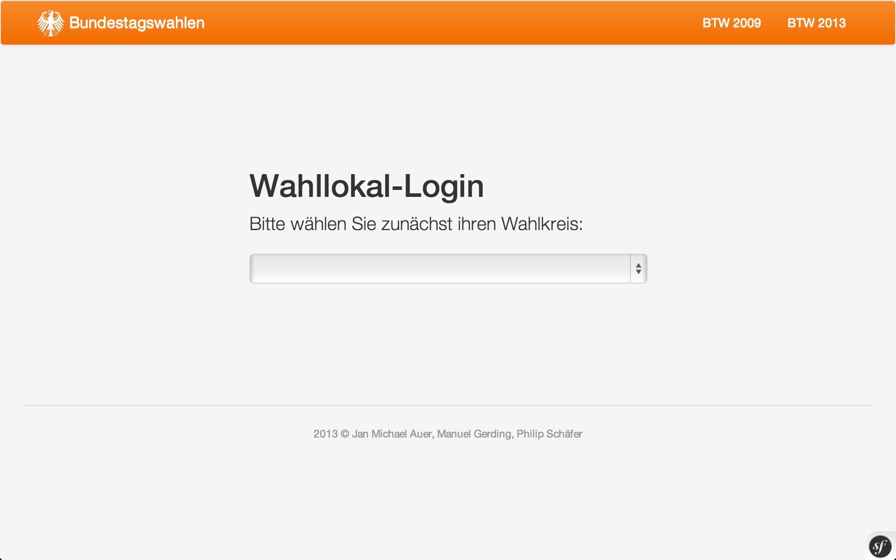
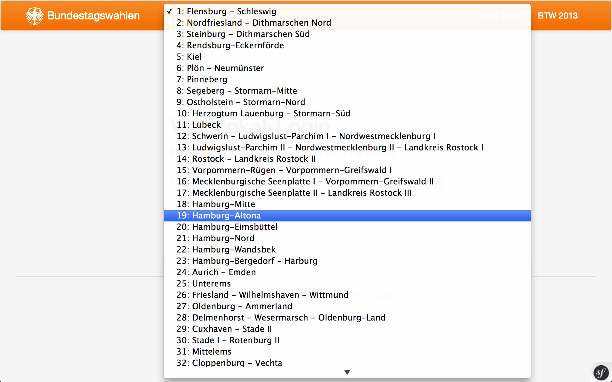
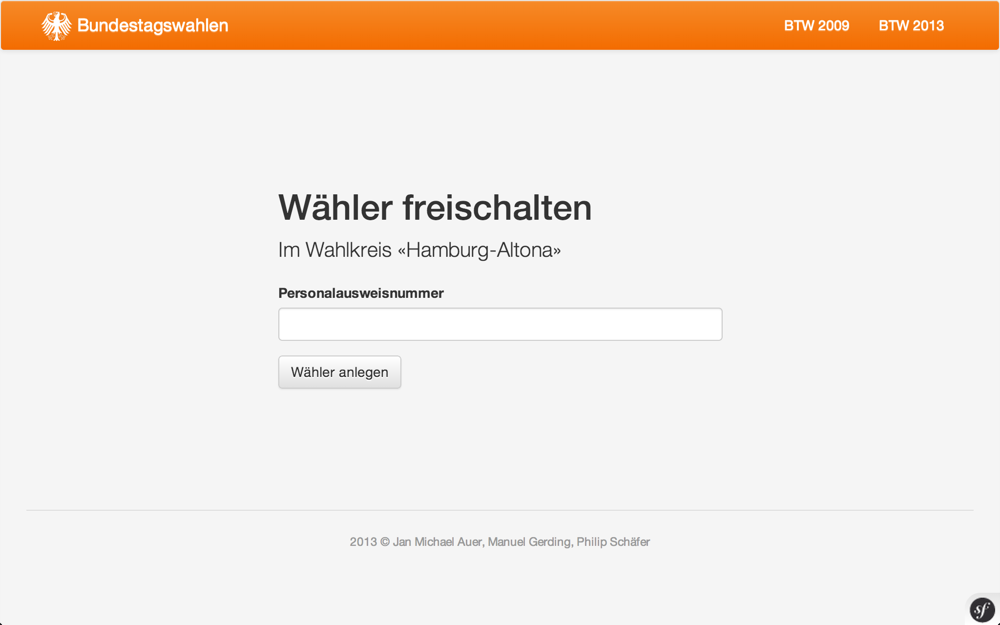
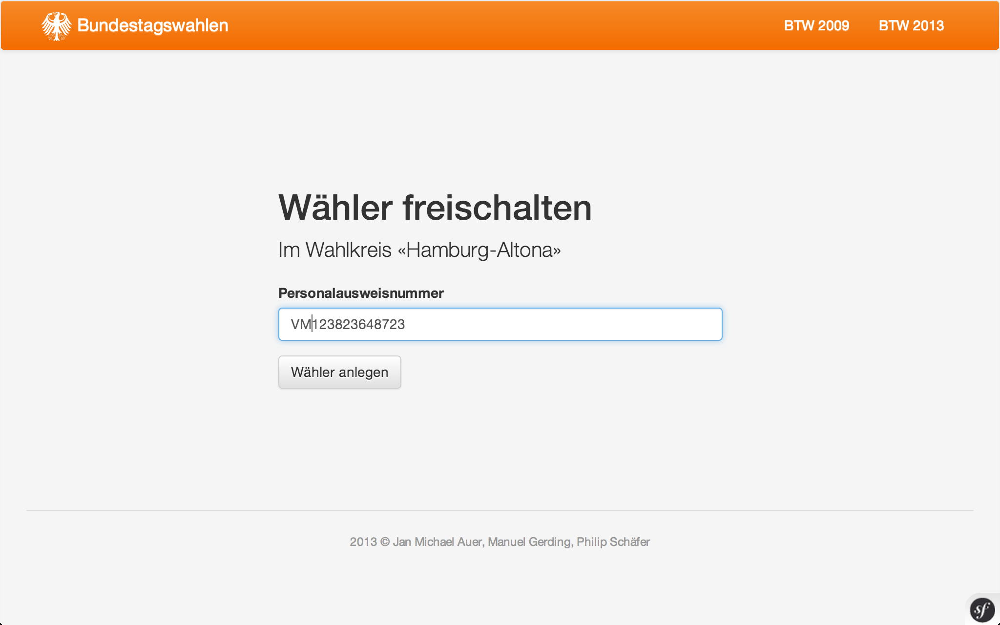
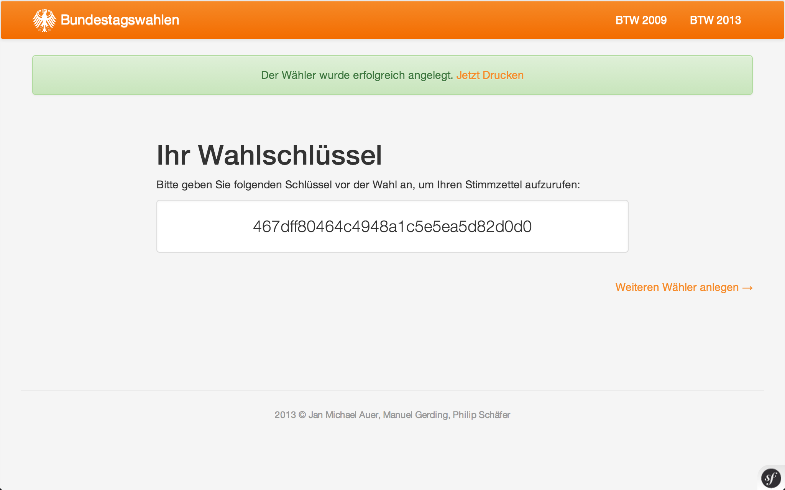
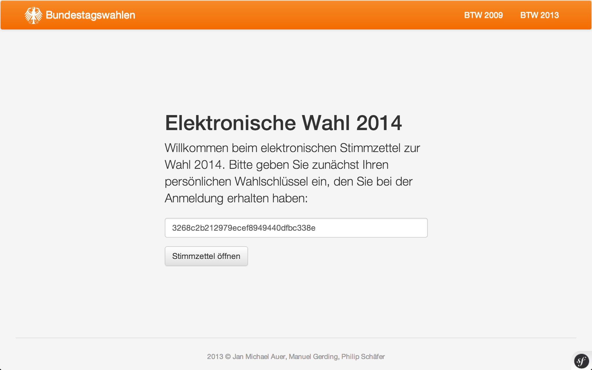
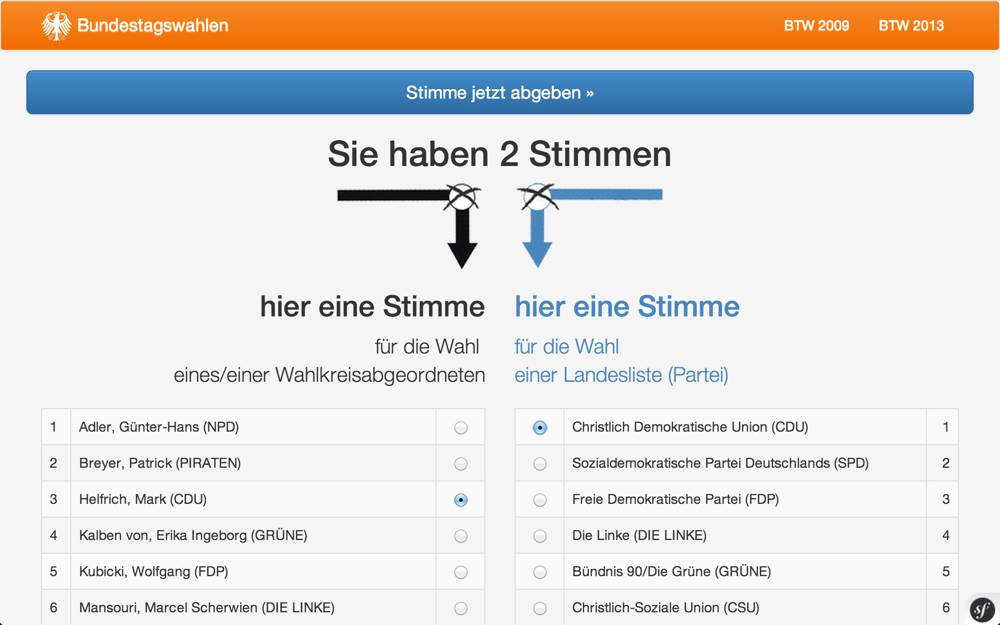
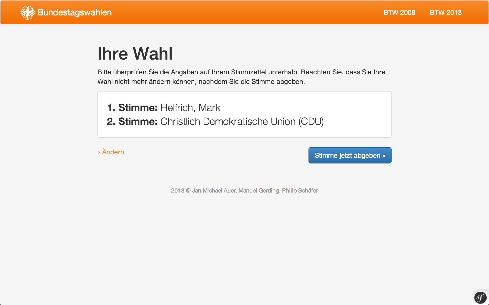
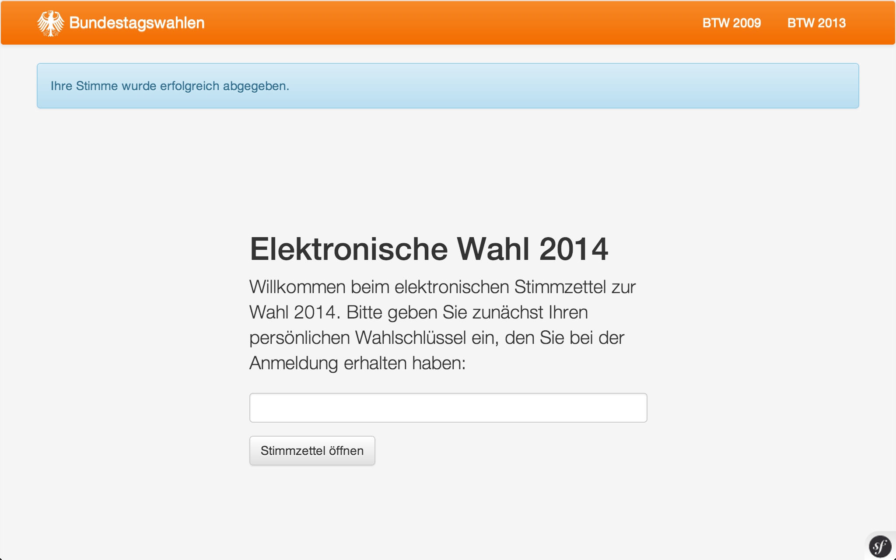

# Elektronische Stimmabgabe

## Prozess

Dieser Abschnitt beschreibt den typischen Wahlprozess unter Anwendung der elektronischen Stimmabgabe, sowohl hinsichtlich organisatorischen als auch technischen Aspekten.
Zur anschaulicheren Darstellung werden im Folgenden ein Wähler Hans sowie eine Wahlhelferin Anke betrachtet.

### 1. Öffnung des Wahlbüros

Zu Beginn ihres Arbeitstages startet Anke ihren PC, auf welchem sie zunächst einen gängingen Webbrowser startet und in selbigem die WIS-URL "/location" aufruft.

In selbigem wählt sie zunächst den für sie gültigen Wahlkreis aus.

Durch Wahl eines Wahlkreises gelangt sie anschließend auf eine Site zur Registrierung eines Wählers für die elektronische Stimmabgabe.

##### Technisch

Der initial ausgewählte Wahlkreis wird für alle anschließenden Wähler-Registrierungen verwendet. 

### 2. Check-In im Wahlbüro

Hans betritt das Wahlbüro und übergibt, wie bereits beim herkömmlichen Wahlgang ohne elektronische Stimmabgabe, der Wahlhelferin Anke seinen Personalausweis.
Anke kontrolliert die Personalien des (potentiellen) Wählers anhand ihrer Wählerliste (was ebenfalls dem herkömmlichen Prozess entspricht) und stellt deren Korrektheit fest. Im Anschluss ließt Anke Hans' Personalausweisnummer und trägt diese in ihre bereits geöffnete Eingabemaske ein (vgl. Schritt 1).

Daraufhin wird Anke vom WIS angeboten, den generierten Wahlschlüssel auszudrucken.

Anke druckt den Wahlschlüssel und händigt ihn Hans aus.

##### Technisch

Bei Eingabe der Personalausweisnummer wird auf Basis selbiger ein MD5-Hash erzeugt - dieser wird im Anschluss als Wahlschlüssel verwendet.
Der generierte Hash wird in der DB persistiert, die entsprechende Entität wird als "noch nicht gewählt" geflaggt.

##### Organisatorisch

Die Verwendung eines derartigen Wahlschlüssels gewährleistet zunächst eine Authentifizierung. Die Überprüfung, ob ein potentieller Wähler im aktuellen Wahllokal tatsächlich wählen darf, wird wie im herkömmlichen Prozess durch eine Wahlhelferin durchgeführt.
Das hier exemplarisch gewählte Verfahren, nämlich die Verschlüsselung der Personalausweisnummer durch MD5, kann natürlich beliebig ausgetauscht werden - beispielsweise durch Verwendung einer eindeutigeren Basis oder durch Verwendung eines anderen Algorithmus'.

### 3. Eigentliche Wahl

Hans begibt sich zunächst in eine Wahlkabine, in welcher er einen laufenden PC mitsamt Tastatur und Maus vorfindet, auf welchem die WIS-Site "/vote" angezeigt wird. Er stellt fest, dass das Verlassen dieser Site bzw. des Browsers nicht möglich ist.
Die Hans angezeigt Site fordert ihn dazu auf, den erhaltenen Wahlschlüssel einzugeben. Hans gibt seinen persönlichen Wahlschlüssel ein und bestätigt.

Hans wird nun eine optisch dem herkömmlichen Wahlzettel nachempfundene Site angezeigt, auf welcher er seine Erst- sowie Zweitstimme angibt.

Hans bestätigt seine Wahl durch Drücken eines Buttons mit der Beschriftung "Stimme jetzt abgeben", woraufhin WIS ihm eine Übersicht über seine abgegebene Erst- sowie Zweitstimme anzeigt. 

Hans kontrolliert seine Stimmabgabe und bestätigt diese im Anschluss endgültig durch Klick auf einen "Bestätigen"-Button.
Daraufhin teilt WIS Hans mit, dass dessen Stimme erfolgreich abgegeben wurde.

Hans stellt nach kurzer Zeit fest, dass die soeben noch angezeigte Erfolgsmeldung verschwunden ist und nun wieder die initiale Sicht zur Eingabe eines Wahlschlüssels angezeigt wird.

Hans verabschiedet sich von Anke und verlässt das Wahllokal. 

##### Technisch

Bei endgültiger Stimmabgabe wird die abgegebene Stimme persistiert, das "voted"-Flag der den aktuellen Wahlschlüssel beinhaltenden Entität wird auf "true" gesetzt - hierdurch wird gewährleistet, dass Hans nicht noch einmal wählen kann. Diese Entität wird nicht mit der abgegebenen Stimme verknüpft.

Der zur Wahl bereit gestellte PC verwendet ein Kiosk-Tooling zur Verhinderung von nicht vorgesehenen Systemzugriffen (wie beispielsweise Zugriffe auf das dahinter liegende OS, manuelle URL-Eingaben etc.).
Die Netzwerkverbindung des Wahl-PCs wurde darüber hinaus durch eine Fachkraft so vorkonfiguriert, dass Internetzugriffe per VPN erfolgen - die "/vote"-Sites des WIS sind nur durch einen entsprechenden VPN-Tunnel zu erreichen.

##### Organisatorisch

Eine Mehrfache Stimmabgabe wird durch Verwendung eines "voted"-Flags hier verhindert, siehe oben.

Eine korrumpierende Verwendung des Wahl-PCs wird weiterhin ausgeschlossen, eine Aufrufbarkeit der Seiten zur elektronischen Stimmabgabe ausschließlich aus Wahllokalen wird durch VPN ermöglicht.

## IT-Security

IT-spezfische Korruptionsmöglichkeiten (wie beispielsweise SQL-Injection) werden durch das verwendete Framework Symfony bereits von Haus aus verhindert.