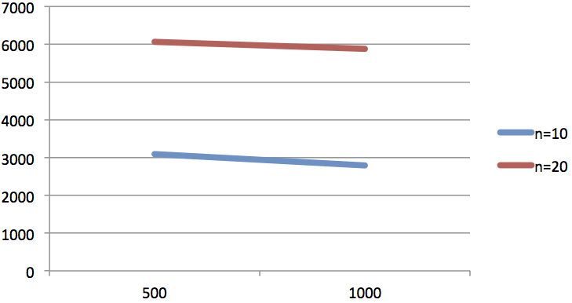
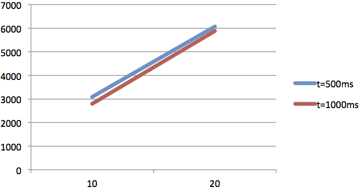

#Benchmark
##Einführung
Dieses Dokument stellt die Benchmark-Ergebnisse des *WIS* dar. Dabei wurde die Performance der Gesamtapplikation getestet, welches beispielsweise den Zugriff über den HTTP Apache2 Server und der PostgreSQL-Datenbank beinhaltet.

Zur Durchführung der Tests wurde eine C#-Applikation entwickelt, die neben den aufzurufenden URLs die Anzahl der Terminals, die durchschnittliche Zeit zwischen den Aufrufen und die Anzahl an Wiederholungen als Parameter übergeben bekommt.

##System
Zur Durchführung des Benchmarks wurde das nachfolgende System verwendet:

<table>
	<tr>
		<td><b>CPU:</b></td>
		<td>Intel Core i5-2520M, 2.5 GHz 
		&nbsp;&nbsp;&nbsp;Level 1: 2x 32KB instruction caches, 2x 32KB data caches 
		&nbsp;&nbsp;&nbsp;Level 2: 2x 256 KB 
		&nbsp;&nbsp;&nbsp;Level 3: 3MB		</td>
	</tr>
	<tr>
		<td><b>RAM:</b></td>
		<td>4 GB</td>
	</tr>
	<tr>
		<td><b>Festplatte:</b></td>
		<td>Seagate Momentus 7200.4 500GB 
		&nbsp;&nbsp;&nbsp;Zugriffszeit 12 ms</td>
	</tr>
	<tr>
		<td><b>Betriebssystem:</b></td>
		<td>Windows 7 (64bit)</td>
	</tr>
</table>

##Ergebnisse
Insgesamt wurden 4 Messreihen durchgeführt, in denen die Queries 1-6 in zufälliger Reihenfolge durchgeführt wurden. Dabei variierte in den 4 Messreihen die Anzahl der Terminals (*n*) und die durchschnittliche Wartezeit (*t*).

### Gesamtresultat
Nachfolgend sind die Ergebnisse des Benchmarks für einen vollständige Workload-Mix aufgezeigt bei 4 unterschiedlichen Messreihen.
<table>
	<tr>
		<th></th>
		<th>t = 500ms</th>
		<th>t = 1.000ms</th>
	</tr>
	<tr>
		<td><b>n = 10</b></td>
		<td>3.088,78 ms</td>
		<td>2.792,44 ms</td>
	</tr>
	<tr>
		<td><b>n = 20</b></td>
		<td>6.066,33 ms</td>
		<td>5.880,29 ms</td>
	</tr>
</table>

Vergleicht man die Auswirkungen der Parameteränderungen bei einem Workload-Mix so fällt auf, dass die Anzahl der Terminals einen größeren Einfluss auf die Performance der Anwendung hat.

### Query-Ergebnisse
In diesem Abschnitt werden die Ergebnisse für die jeweiligen Queries einzelnd aufgeführt, um so besser zu erkennen, welches Query ggf. optimiert oder geachet werden könnte.

#### Query 1
<table>
	<tr>
		<th></th>
		<th>t = 500ms</th>
		<th>t = 1.000ms</th>
	</tr>
	<tr>
		<td><b>n = 10</b></td>
		<td>4.205,09 ms</td>
		<td>3.780,02 ms</td>
	</tr>
	<tr>
		<td><b>n = 20</b></td>
		<td>7.525,19 ms</td>
		<td>7.045,54 ms</td>
	</tr>
</table>

#### Query 2
<table>
	<tr>
		<th></th>
		<th>t = 500ms</th>
		<th>t = 1.000ms</th>
	</tr>
	<tr>
		<td><b>n = 10</b></td>
		<td>7.416,66 ms</td>
		<td>6.921,00 ms</td>
	</tr>
	<tr>
		<td><b>n = 20</b></td>
		<td>10.742,98 ms</td>
		<td>10.861,22 ms</td>
	</tr>
</table>

#### Query 3
<table>
	<tr>
		<th></th>
		<th>t = 500ms</th>
		<th>t = 1.000ms</th>
	</tr>
	<tr>
		<td><b>n = 10</b></td>
		<td>1.857,91 ms</td>
		<td>1.516,21 ms</td>
	</tr>
	<tr>
		<td><b>n = 20</b></td>
		<td>4.483,23 ms</td>
		<td>4.573,35 ms</td>
	</tr>
</table>

#### Query 4
<table>
	<tr>
		<th></th>
		<th>t = 500ms</th>
		<th>t = 1.000ms</th>
	</tr>
	<tr>
		<td><b>n = 10</b></td>
		<td>1.544,65 ms</td>
		<td>1.463,73 ms</td>
	</tr>
	<tr>
		<td><b>n = 20</b></td>
		<td>4.601,45 ms</td>
		<td>3.989,43 ms</td>
	</tr>
</table>

#### Query 5
<table>
	<tr>
		<th></th>
		<th>t = 500ms</th>
		<th>t = 1.000ms</th>
	</tr>
	<tr>
		<td><b>n = 10</b></td>
		<td>1.856,64 ms</td>
		<td>1.594,87 ms</td>
	</tr>
	<tr>
		<td><b>n = 20</b></td>
		<td>4.822,42 ms</td>
		<td>4.744,74 ms</td>
	</tr>
</table>

#### Query 6
<table>
	<tr>
		<th></th>
		<th>t = 500ms</th>
		<th>t = 1.000ms</th>
	</tr>
	<tr>
		<td><b>n = 10</b></td>
		<td>1.651,7 ms</td>
		<td>1.478,79 ms</td>
	</tr>
	<tr>
		<td><b>n = 20</b></td>
		<td>4.222,7 ms</td>
		<td>4.067,44 ms</td>
	</tr>
</table>
