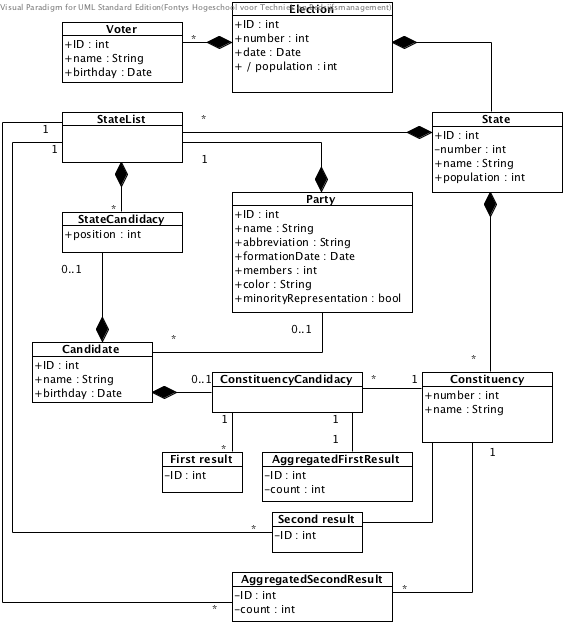

# Pflichtenheft

## Einführung

Mit **WIS** wird ein Wahlinformationssystem für deutsche Bundestagswahlen entwickelt, mit dem Interessierte vor der Wahl Informationen abfragen, sowie nach der Wahl Analysen und Statistiken über die Wahlergebnisse erstellen können. Hierzu zählen insbesondere auch Vergleiche der Wahlergebnisse mit vorangegangen Wahlen.

Das Wahlsystem ist als Webapplikation konzipiert und stellt dort zusätzlich zu den Wahlergebnissen der letzten Wahlen auch allgemeine Informationen zu den Parteien dar. Im weiteren Verlauf soll die Stimmabgabe durch die Wähler am Wahltag ebenfalls durch eine eigene Schnittstelle des Wahlsystems ermöglicht werden.

## Benutzergruppen

Das Wahlinformationssystem wird von den folgenden Benutzergruppen über die Webschnittstelle verwendet:

####Analytiker
Die erste Gruppe ist die der "Analytiker", die das Webangebot ohne Authenitifizierung anonym nutzen können. Diese informieren sich typischerweise über die Ergebnisse der Bundestagswahl und vergleichen diese mit Ergebnissen aus den vorherigen Jahren. Dabei haben sie zudem die Möglichkeit, die Informationen auf verschiedenen Granularitätsebenen zu betrachten (beispielsweise auf der Ebene eines Wahlkreises oder Bundeslandes).
 
####Wähler
Die Gruppe der Wähler hat, nach der Idenfitikation mit dem System, die Möglichkeit für eine laufende Bundestagswahl seine Stimme abzugeben. Dabei muss natürlich berücksichtigt werden, dass eine Mehrfachabstimmung für eine Bundestagswahl nicht möglich ist. Die Unterstützung dieser Benutzergruppe ist erst für eine zukünftige Version des **WIS** geplant.

####Wahllokalleiter
Repräsentativ für ein Wahllokal steht der Wahllokalleiter. Dessen Verantwortlichkeit liegt in dem Einpflegen in das **WIS** von abgegebenen Stimmen während einer laufenden Bundestagswahl. Dadurch wird es der Benutzergruppe der Analytiker ermöglicht eine zeitnahe Hochrechnung bei einer laufenden Wahl einsehen zu können.

####Administrator
Administratoren des Systems haben die Verantwortlichkeit der Stammdatenverwaltung. Darunter fällt beispielsweise das Anlegen einer neuen Wahl und der dazugehörigen Aufteilung in Bundesländer, Wahlkreise, Wahlbezirke etc. Ferner fällt die Benutzer- und Gruppenverwaltung in das Aufgabengebiet des Administrators.

## Benutzer-Schnittstelle
Wie bereits angesprochen wird das Wahlinformationssystem über ein Web-Frontend den verschiedenen Benutzergruppen zur Verfügung gestellt. Dabei stellt die nachfolgende Abbildung die angesprochenen Akteure und dessen Anwendungsfälle auf einem hohen Abstraktionslevel dar.

## Funktionale Anforderungen

### Analytiker

`AL01` `Must-Have`

Als Analytiker möchte ich Wahlergebnisse bundesweit, pro Bundesland sowie pro Wahlkreis vergleichen.

-----

`AL02` `Must-Have`

Als Analytiker möchte ich Wahlergebnisse (bundesweit, pro Bundesland sowie pro Wahlkreis) aus verschiedenen Jahren vergleichen.

-----

`AL03` `Must-Have`

Als Analytiker möchte ich den Gewinner eines Wahlkreises (vgl. Direktmandat) ermitteln.

-----

`AL04` `Must-Have`

Als Analytiker möchte ich alle Mandate innerhalb eines Bundeslands (bzw. auch bundesweit) auflisten.

-----

`AL05` `Should-Have`

Als Analytiker möchte ich alle Koalitionsmöglichkeiten für ein beliebiges Wahlergebnis bestimmen.

-----

`AL06` `Could-Have`

Als Analytiker möchte ich die Anzahl der Sitze im Bundestag eines beliebigen Bundeslands bestimmen.

-----

`AL07` `Could-Have`

Als Analytiker möchte ich die Sitzverteilung auf Parteien für ein beliebiges Bundesland bestimmen.

### Wähler

`WA01` `Must-Have`

Als Wähler möchte ich die Möglichkeit haben, eine Erst- und eine Zweitstimme für eine laufende Bundestagswahl abzugeben.

-----

`WA02` `Must-Have`

Als Wähler muss ich mich eindeutig authentifiziert haben, um eine Stimme abgeben zu können.

### Wahllokalleiter

`WL01` `Must-Have`

Als Wahllokalleiter möchte ich abgegebene Stimmen in das System einpflegen können.

-----

`WL02` `Must-Have`

Als Wahllokalleiter möchte ich im Fehlerfall Wahlstimmen einer aktuellen Wahl ändern können.

-----

`WL03` `Must-Have`

Als Wahllokalleiter muss ich mich eindeutig authentifiziert haben, um auf das System zugreifen zu können.

### Administrator

`AD01` `Must-Have`

Als Administrator möchte ich eine anstehende Wahl hinzufügen, ändern oder löschen.

-----

`AD02` `Must-Have`

Als Administrator möchte ich eine beliebige Partei hinzufügen, ändern oder löschen.

-----

`AD03` `Must-Have`

Als Administrator möchte ich die Länderliste einer beliebigen Partei für eine anstehende Wahl hinzufügen, ändern oder löschen. 

-----

`AD04` `Must-Have`

Als Administrator möchte ich den Direktkandidaten eines beliebigen Wahlkreises für eine anstehende Wahl hinzufügen, ändern oder löschen.

-----

`AD05` `Must-Have`

Als Administrator möchte ich ein beliebiges Bundesland hinzufügen, ändern oder löschen.

-----

`AD06` `Must-Have`

Als Administrator möchte ich einen beliebigen Wahlkreis hinzufügen, ändern oder löschen.

-----

`AD07` `Must-Have`

Als Administrator möchte ich einen beliebigen Wahlbezirk hinzufügen, ändern oder löschen.

-----

`AD08` `Must-Have`

Als Administrator möchte ich ein beliebiges Wahllokal hinzufügen, ändern oder löschen.

-----

`AD09` `Must-Have`

Als Administrator muss ich mich eindeutig authentifiziert haben, um auf das System zugreifen zu können.

## Nicht-Funktionale Anforderungen

`NF01` `Must-Have`

Datenschutzrichtlinien müssen berücksichtigt werden.

-----

`NF02` `Must-Have`

Webinterface nutzbar mit Firefox 24.0, Chrome 30.0.1599.101 und Safari 7.0.

-----

`NF03` `Must-Have`

Ermittlung der Wahlergebnisse muss in unter 1 Minute erfolgen.

-----

`NF04` `Must-Have`

Das System muss am Wahltag bis zu 20.000 Inserts pro Stunde unterstützen.

-----

`NF05` `Must-Have`

Das Server-System muss auf Windows und Linux portierbar sein.

## Entwurf

Technologien:

 - DB: Postgres
 - Sprache: PHP
 - OR-Mapper: Doctrine
 - Framework: Symfony
 - Frontend: Bootstrap
 
### Persistierung der Daten

Relevante Daten sollen in einem RDBMS persistiert werden (Technologie s. Abs. *Technologien*). Grundlage zur logischen Datenorganisation bildet hierbei unten stehendes E/R-Diagramm:

### GUI-Mockups
Die nachfolgende Übersicht gibt einen Einblick in die Navigation der Webapplikation. Dabei besteht die Webseite aus zwei zentralen Startpunkten: Zum einen der Login-Bereich für Wähler, der nur innerhalb eines Wahllokals aufrufbar ist und das Abgeben einer Stimme vom Wähler direkt ermöglichen wird. Dem gegenüber steht die Startseite des **WIS**, die im Internet erreichbar ist und den Zugriff auf weitere Analysen, sowie dem Administrations- und Wahllokalbereich ermöglicht.

## Abnahmeszenarien

### Szenario 1: Authentifizierung als 

**Schritte:**

 - Zugriff auf eine geschützte Seite ohne Login.
 - Einloggen mit falschen Benutzerdaten.
 - Einloggen mit korrekten Benutzerdaten.
 
**Erwartete Resultate:**

 - Zugriff ohne Login war nicht möglich.
 - Login mit falschen Benutzerdaten war nicht möglich.
 - Login mit korrekten Benutzerdaten war möglich.

### Szenario 2: Wartung von Parteidaten

**Schritte:**

 - Hinzufügen einer neuen Partei und Hochladen eines Bildes.
 - Ändern des Namens einer bestehenen Partei.
 - Ändern des Bildes einer bestehenden Partei.
 - Löschen einer bestehenden Partei. 
 
**Erwartete Resultate:**

 - Die gespeicherten Daten sind persistiert.
 - Vergangene Wahlen müssen von diesen Änderungen unberührt bleiben.
 - Zukünftige Wahlen werden mit den neuen Informationen aktualisiert. 
 - Die Änderungen sind auf der Webseite sichtbar.

### Szenario 3: Wartung demographischer Daten

**Schritte:**

 - Hinzufügen eines neuen Wahlkreises.
 - Hinzufügen von Wahllokalen zu dem neuen Wahlkreis .
 - Ändern der Einwohnerzahl eines Wahlkreises.
 - Ändern der Einwohnerzahl eines Wahrkreises mit zu großer Abweichung vom Durchschnitt.

**Erwartete Resultate:**

 - Die gespeicherten Daten sind persistiert.
 - Vergangene Wahlen müssen von diesen Änderungen unberührt bleiben.
 - Zukünftige Wahlen werden mit den neuen Informationen aktualisiert. 
 - Das Speichern des Wahlkreises mit zu großer Abweichung von der durchschnittlichen Einwohnerzahl war nicht möglich.
 - Die Einwohnerzahlen der Bundesländer wurden basierend auf den neuen Informationen der Wahlkreise aktualisiert.

### Szenario 4: Wartung von Wahldaten

**Schritte:**

 - Erstellen einer neuen Wahl.
 - Auswahl der kandidierenden Parteien.
 - Hinzufügen von Kandidaten zu den Landeslisten und Wahlkreisen.
 
**Erwartete Resultate:**

 - Die gespeicherten Daten sind persistiert.
 
### Szenario 5: Auswertung von Wahlergebnissen

 - Eintragen der letzten Wahlergebnisse zur Auswertung.
 - Bundesweite Abfrage der Zweitstimmen.
 - Landesweite Abfrage der Zweitstimmen.
 - Abfrage der gewählten Direktmandate. 
 - Abfrage der Sitzverteilung im Bundestag auf Bundesebene.
 - Abfrage der Sitzverteilung im Bundestag auf Landesebene.

**Erwartete Resultate:**

 - Die Auswertungen stimmen mit den tatsächlichen Wahlergebnissen überein.